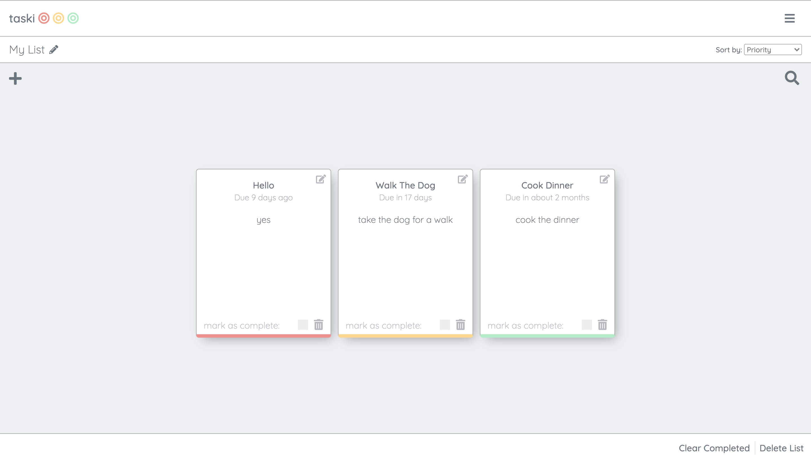

# Taski Todo List App

A Responsive Todo list app built with Bootstrap.

### Screenshot

### Built with

- HTML/SCSS
- Javascript
- [Bootstrap](https://getbootstrap.com/)- CSS Framework

### Features
The user is presented with a default list which is empty. To add a new task they must click the plus in the right hand corner and fill in each of sections. upon completion a task will be added and an alert will be shown to advise the user they were successful.

### Potential Future Features

- Adding a log-in feature so tasks can be accessed from different machines.
