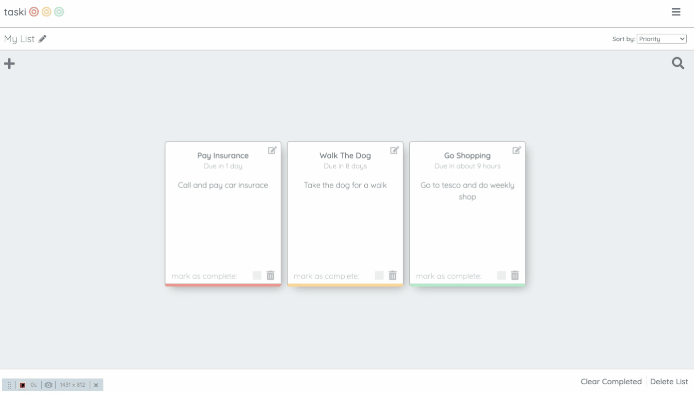
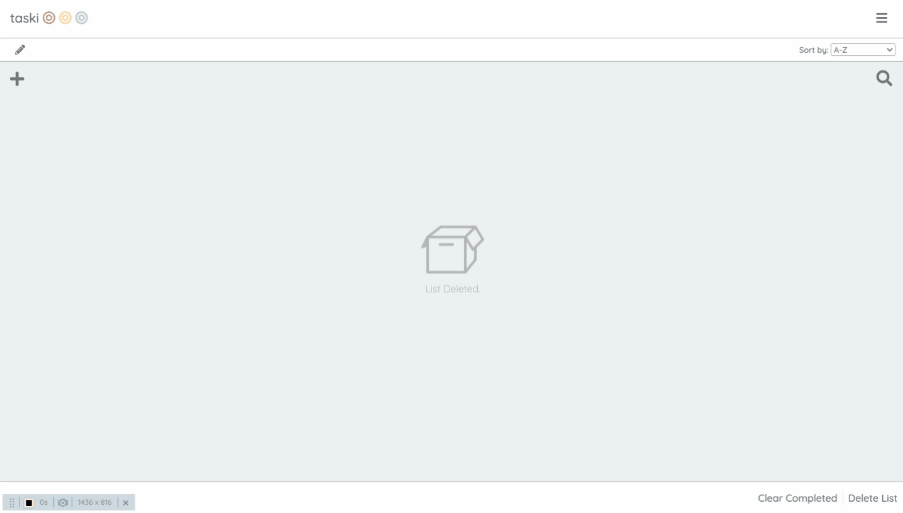

# Taski Todo List App

A Responsive Todo list app built with Bootstrap.

### Screenshot


### Built with

- HTML/SCSS
- Javascript
- [Bootstrap](https://getbootstrap.com/)- CSS Framework

### Features

The user is presented with a default list which is empty. To add a new task they must click the plus in the right hand corner and fill in each of sections. upon completion a task will be added and an alert will be shown to advise the user they were successful.


When there are multiple tasks in a list they can be sorted by priority, deadline, date created or alphabetically by selecting the sort by button.



this sort functionality was achieved using an event listener on the dropdown box which renders the sorted list each time its fired.

```javascript
ui.sortDropdown.addEventListener('change', function (e) {
  // render tasks
  ui.renderTasks(storageAndData.findSelectedList().tasks);
});
```

The user can also clear any completed tasks or delete the list entirely by using the buttons in the bottom right corner.


To create a new list the user can open the side menu and enter the list name in the input box, clicking the plus button to confirm.



There is also a search feature which can be found in the upper right hand corner. When the user types in this search field the tasks are filtered to match the input.


This functionality was achieved by filtering the rendered tasks depending on the input.

```javascript
ui.searchInput.addEventListener('input', function (e) {
  // get input value from search box
  const input = ui.searchInput.value;
  // filter the tasks using the input
  const filteredTasks = storageAndData.filterTasks(input);
  // render the filtered tasks to page
  ui.renderTasks(filteredTasks);
});
```

### Potential Future Features

- Adding a log-in feature so tasks can be accessed from different machines.
